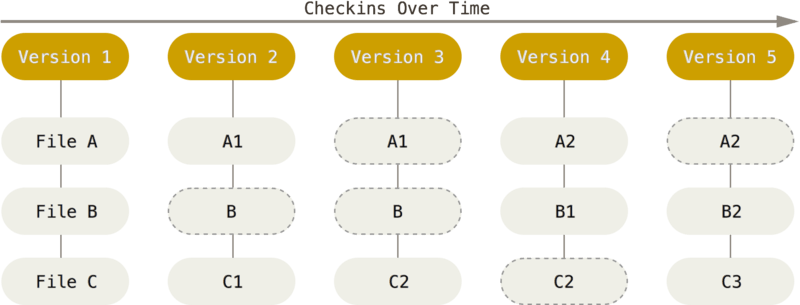

#HSLIDE

# GIT

#HSLIDE
###Disclaimers
* Not a git expert
* Plenty of better resources available
* **You will remember very little of this**

#HSLIDE
### What to take home
* Use git (or more appropriate solution)
* Look it up yourself!

#HSLIDE
### Plan

* What is git?
    - Distributed version control
    - History
* Key concepts
* Git 101
* Use Cases

#HSLIDE
# What is git
source: [wikipedia](https://git-scm.com/book/en/v2/Getting-Started-Git-Basics)

#HSLIDE
### Distributed Version Control
* Version Control System
* Distributed - every copy of the codebase is a complete repository

#HSLIDE
### History
* Created in 2005 by Linus Torvalds after Bitkeeper agreement ended.
* Criterias for creation
    - patching time < 3s
    - Take Concurrent Versions System (CVS) as an example of what not to do; if in doubt, make the exact opposite decision
    - Support a distributed, BitKeeper-like workflow
    - Include very strong safeguards against corruption, either accidental or malicious

#HSLIDE
From the [official readme](https://github.com/git/git/blob/e83c5163316f89bfbde7d9ab23ca2e25604af290/README) :

<blockquote style="font-size: 8px, font-family: courrier">

 The name "git" was given by Linus Torvalds when he wrote the very
 first version. He described the tool as "the stupid content tracker"
 and the name as (depending on your way):

  - random three-letter combination that is pronounceable, and not
    actually used by any common UNIX command.  The fact that it is a
    mispronunciation of "get" may or may not be relevant.
  - stupid. contemptible and despicable. simple. Take your pick from the
    dictionary of slang.
  - "global information tracker": you''re in a good mood, and it actually
    works for you. Angels sing, and a light suddenly fills the room.
 - "g*dd*mn idiotic truckload of sh*t": when it breaks

#HSLIDE
# Key concepts
source: [git-scm.com](https://git-scm.com/book/en/v2/Getting-Started-Git-Basics)

#HSLIDE
### Snapshots, Not Differences
Most systems store information as file-based changes.

#HSLIDE
* Data is a set of snapshots of a **miniature file system**.
* Picture of what all files look like at a saved moment - reference of the snapshot is stored
* Git stores unchanged files as a link to the previous identical file it has stored

#HSLIDE
### Nearly every operation is local

Entire history of the project is stored locally, e.g. looking up history can be done without talking to *a* central repository.

#HSLIDE
### Git has integrity
* Everything in Git is check-summed (SHA-1 hash) before it is stored and is then referred to by that checksum
    - Built at lowest level
    - Impossible to change content of any file without having git knowing about it
    - Impossible to lose informaiton in transit or get file corruption without git knowing about it
* Git stores everything in its database not as filename but by the **hash value of its contents**

#HSLIDE
### Git Generally Only Adds Data
* Once a snapshot is committed it is virtually impossible to lose data.

#HSLIDE
### The Three States
* Committed: Data is safely stored in your local database
* Modified: File has changed but has not been stored in local database
* Staged: File has been marked in its current version to go into your next commit snapshot

#HSLIDE
### ... And The Three Areas
* Git directory
    - Where Git stores the metadata and object database for your project
    - Most important part of Git
* Working directory
    - Single checkout of one version of the project
    - Pulled out of the compressed database in the Git directory and placed on disk
* Staging area
    - A file that stores information about what will go into next commit
    - Sometimes referred to as the “index”

#HSLIDE

#HSLIDE
# Git 101
Just do it
* setup your own repo (github, gitlab, bitbucket, etc.)
* alternatively [try.github.io](https://try.github.io)

#HSLIDE
# Use Cases
... or why we should use version control more

#HSLIDE
### Code management
* Group projects
* Individual projects (!!)

#HSLIDE
### Text Is Great
* Text = diffs !
* Formatting is available AND (very) powerful
    - Markdown
    - LaTeX
* This presentation was built using a single Markdown file, stored on github(https://github.com) and served as a slideshow using [GitPitch](https://gitpitch.com/)

#HSLIDE

